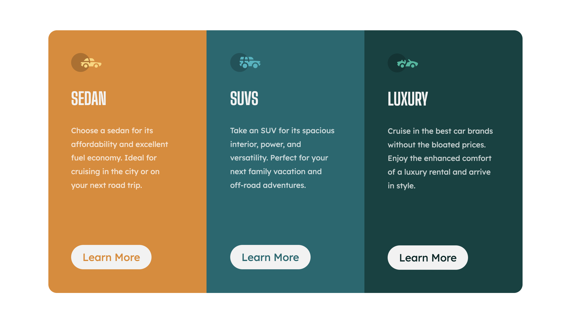

# Frontend Mentor - 3-column preview card component solution

This is a solution to the [3-column preview card component challenge on Frontend Mentor](https://www.frontendmentor.io/challenges/3column-preview-card-component-pH92eAR2-).

##Table of Contents

- [Overview](#overview)
  - [The challenge](#the-challenge)
  - [Screenshot](#screenshot)
  - [Links](#links)
- [My process](#my-process)
  - [Built with](#built-with)
  - [What I learned](#what-i-learned)
  - [Continued development](#continued-development)
  - [Useful resources](#useful-resources)
- [Author](#author)
- [Acknowledgments](#acknowledgments)

## Overview

### The challenge

In this project the users will be able to;

- View the optimal layout depending on their device's screen size
- See hover states for interactive elements

### Screenshot



### My Process

## Built With

This project was built using plain vanilla CSS and HTML. I also got to use custom CSS porperties like GRID to structure the layout when building the mobile and the desktop design. The design was done with a desktop-first workflow.

### What I Learnt

1. **HTML**

   Learnt how to use HTML to properly structure web content while using the proper semantic tags.

```html
<main>
  <section>I am used to define the section of a document</section>
</main>
```

2. **CSS**

   Learnt how to use CSS to style the web contents alos adding some layouts as well learning how to use svg images in css and finally making use of media queries

```css
.card-component-grid {
  display: grid;
  grid-template-columns: repeat(3, 1fr);
  border-radius: 1.8rem;
  overflow: hidden;
}

.svg-img{
  margin-bottom-20px;
}

@media(max-width:28em){

}
```

### Continued Development

For my continued Development I would definitely love to learn to make more layouts using grid and flexbox. Learning more custom CSS properties would also be necessary. Learning more about Grid and its properites will also be very useful in makinhg even more compex layouts.

### Resoureces Used

-[Freecodecamp](https://www.freecodecamp.org/news/use-svg-images-in-css-html)- This is a very useful website as it got me to know to to add svg images to CSS and I would recommend reading up on this to know how I was able to achieve this to do this project.

## Author

- Frontend Mentor - [@yourusername](https://www.frontendmentor.io/profile/_salutDami)
- Twitter - [@\_salutDami](https://www.twitter.com/_salutDami)
- Linkedin - [Ikuomola Stephen](https://www.linkedin.com/in/Ikuomola-Stephen/)
